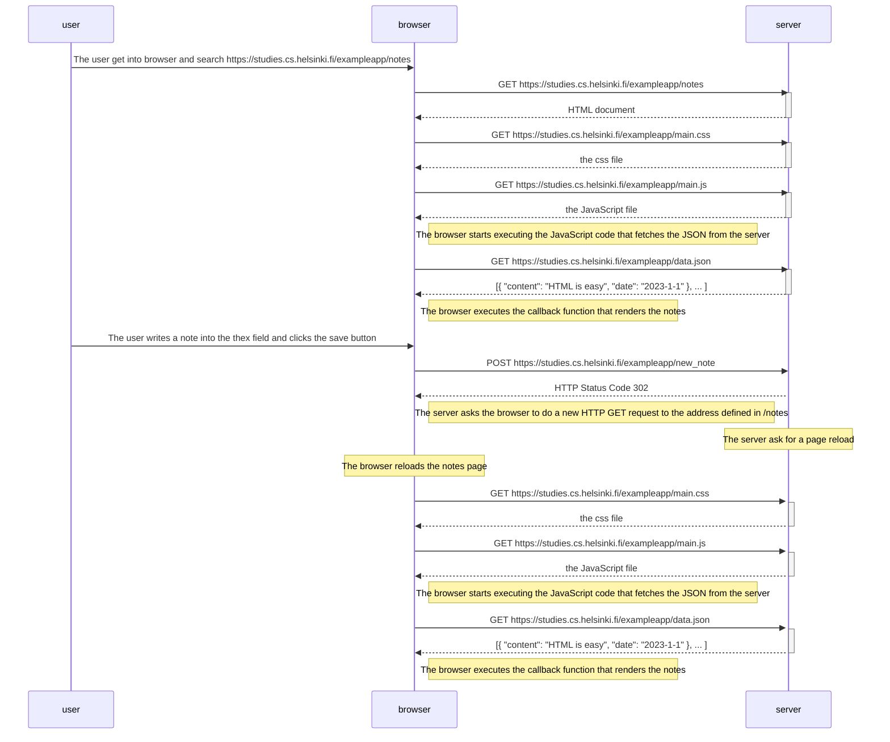
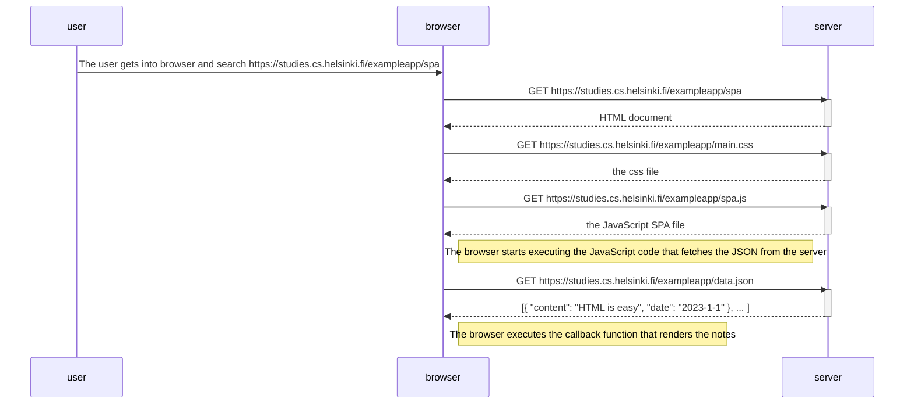
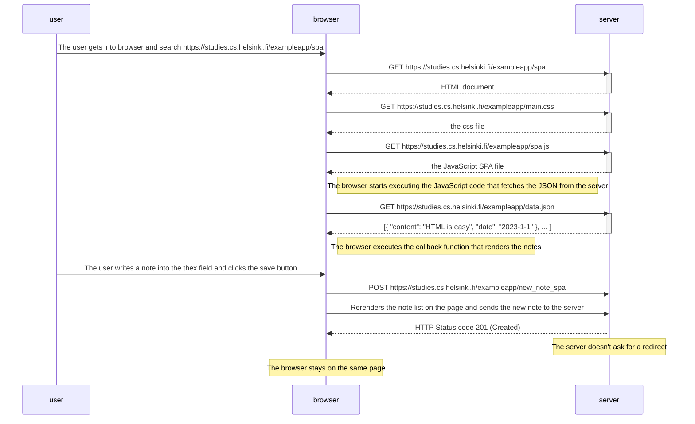

## Exercise 0.4

Chain of events caused when the user creates a new note on the page https://studies.cs.helsinki.fi/exampleapp/notes by writing something into the text field and clicking the save button.

## Exercise 0.5

Chain of events caused where the user goes to the single-page app version of the notes app at https://studies.cs.helsinki.fi/exampleapp/spa.

## Exercise 0.6

Chain of events caused where the user creates a new note using the single-page version of the app.

